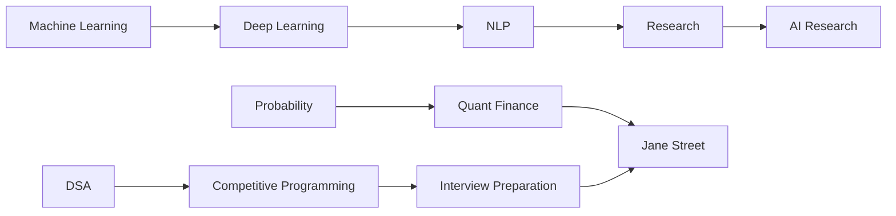

<div align="center">

# 👋 Hi, I'm Aditya Raj

### 🎓 Incoming Artificial Intelligence & Computer Science Student
### 🏛️ University of Edinburgh


</div>

---

## 🚀 Current Focus

<div align="center">


</div>

<br>

| Domain | Status |
|----------|----------|
| 📚 Data Structures & Algorithms | Active |
| 🎲 Probability & Statistics | Active |
| 💹 Quantitative Finance | Active |
| 🤖 Machine Learning | Active |
| 🧠 Deep Learning | Active |
| 🗣️ NLP | Active |
| 🔬 Research | Active |

---

## 🎯 Long-Term Goals

```text
Jane Street FTTP
Jane Street SEE
Quant Trading Internships
AI Research
ML Engineering
```

---

## 🛠 Tech Stack

<div align="center">


</div>

---

## 📂 Main Repositories

| Repository | Purpose |
|------------|----------|
| 📘 DSA-Journey | DSA + Striver + Codeforces |
| 🎲 Probability-Statistics | Quant Mathematics |
| 💹 Quant-Prep | Jane Street Preparation |
| 🤖 Machine-Learning-Foundations | ML Theory & Implementation |
| 🧠 Deep-Learning-Lab | ANN, CNN, RNN, Transformers |
| 🗣️ NLP-Lab | NLP Projects |
| 🔬 Research-Lab | Research Papers & Summaries |
| 📔 Learning-OS | Daily Learning Logs |
| 🚀 Portfolio-Projects | Showcase Projects |

---

## 📈 GitHub Stats

<div align="center">


</div>

---

## 📊 Most Used Languages

<div align="center">


</div>

---

## 🏆 Learning Roadmap



---

## 📅 Current Mission

```yaml
University:
  University of Edinburgh

Program:
  Artificial Intelligence & Computer Science

Current Target:
  Summer 2027 Internship

Focus Areas:
  - DSA
  - Probability
  - Quant
  - ML
  - Deep Learning
  - NLP
  - Research

Target Companies:
  - Jane Street

```

---

<div align="center">

### ⚡ Building Every Day

*"Everything I learn is documented publicly."*

</div>
